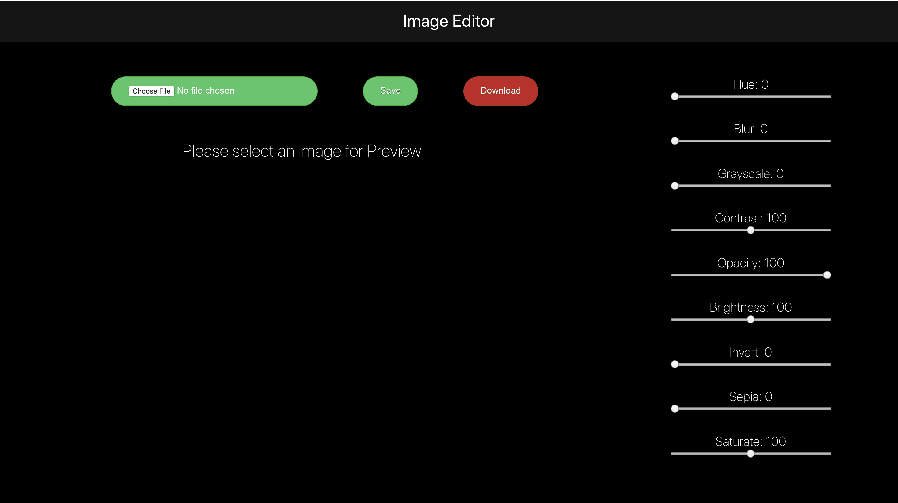

# Image Editor

Real time image editor
Upload an image, add filters and download it to your computer

Live link: 🔗 https://liyasileshi.github.io/image-editor/

## Getting Started

These instructions will get you a copy of the project up and running on your local machine for development and testing purposes.

### Prerequisites

- React

### Installing

> To get started...

- **Option 1**
    - 🍴 Fork this repo!

- **Option 2**
    - 👯 Clone this repo to your local machine using `https://github.com/liyaSileshi/image-editor.git`

## Built With

* [React](https://reactjs.org/)

## Authors 🇪🇹

* **Liya Tilahun** 

## Acknowledgments 🙏🏽

* My FEW instructor Mitchell Hudson
